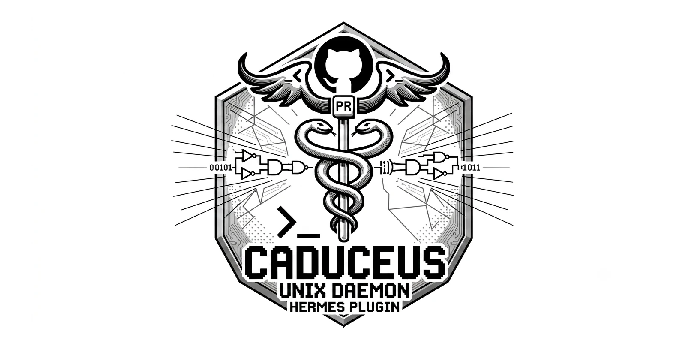

# Caduceus

<p align="center"><em>Your agent does the thinking. Caduceus does the paperwork.</em></p>

<p align="center">
  <a href="https://github.com/barkley-assistant/caduceus/releases"></a>
  <a href="LICENSE"></a>
  <a href="https://github.com/barkley-assistant/caduceus/actions/workflows/ci.yml"></a>
  <a href="https://github.com/barkley-assistant/caduceus/wiki"></a>
</p>

> A Hermes plugin that turns a labeled GitHub issue into a pull
> request, without making you babysit it.

Caduceus is a Unix daemon, shipped as a Hermes plugin, that polls
GitHub for labeled issues, runs your AI harness against them in
isolated worktrees, enforces hard timeouts, and finalizes the
result as branch → push → PR → close. Linux is tier-1; macOS is
tier-2: it compiles, runs, and is enforced by CI (`macos / test`),
with real process-identity (`proc_pidinfo`), descendant reaping
(`proc_listchildpids`), and subreaper semantics on Linux only
(`prctl(PR_SET_CHILD_SUBREAPER)`; macOS relies on process-group
kills plus best-effort descendant enumeration — grandchildren that
`setsid` away are still reaped via the portable seam). Windows is
not a target. This is not the project for you if that's a problem.

We're opinionated about three things, and the rest of this
document will tell you what they are, why, and how to push
back when we're wrong:

1. **Deterministic infrastructure does not live inside the
   non-deterministic loop.** The daemon owns polling,
   claims, worktrees, timeouts, Git, GitHub, retries, and
   the public-voice rule. The worker owns "what does the
   code say, and what should it say next?" They meet at a
   single env-var contract and a single `worker-result.json`
   file. We will not put an LLM call inside our state
   machine, and we will not put a GitHub API client
   inside your harness.
2. **Zero inbound networking, no shortcuts around the
   public-voice rule.** The daemon is pull-only, refuses
   to listen on any port, and refuses to publish a
   comment or PR body containing a hardcoded list of
   internal tool names. This is the only moralizing we
   do in the codebase, and we will defend it.
3. **The bridge is a file you own.** Setup seeds a
   reference bridge at
   `~/.hermes/caduceus/worker-bridge.py`. You edit that
   file. You point it at pi, codex, claude-code, or your
   own custom harness — Caduceus has no opinion about
   which one. Plugin source updates will not overwrite
   your bridge. If the upstream bridge template changes,
   setup writes a sibling `.new` candidate and tells
   you, instead of clobbering your edits.

If you want a managed hosted product with a web dashboard
and a monthly invoice, this is not it. If you want a
single Rust binary and a Python script and the ability to
read every line of the code that runs on your behalf,
welcome.

**A note on what this project is for**: Caduceus exists
to reduce the operator's workload, not to remove the
operator from the loop. Every PR Caduceus opens is
opened for a human to read and merge. The daemon
surfaces state and failures; humans decide what to do
about them. We are not building toward a system where a
bot ships code unattended while the maintainers sleep.
If that is what you want, this is not the project for
you either.

## How It Works

```
                ┌─────────────────────────────┐
   [GitHub]◀───▶│       Caduceus daemon       │◀─── `caduceus run`
   (outbound    │  (Rust · single binary)     │     every 2 min,
    only)       │  · ETag-aware 304 polling   │      cron-driven
                │  · scheduler leadership     │
                │  · per-issue claim files    │
                │  · isolated git worktrees   │
                │  · hard worker timeout      │
                │  · public-voice validator   │
                └──────────────┬──────────────┘
                               │  sanitized env (no gh creds)
                               │  bounded transcript pipe
                               ▼
                ┌─────────────────────────────┐
                │    your worker-bridge.py     │  ← you own this
                │   (the bridge is harness-    │     file. edit it.
                │    agnostic; ship the        │
                │    reference or your own)    │
                └─────────────────────────────┘
```

The daemon polls, picks one or more issues per tick, claims each
under a per-issue lease (bounded by `worker_parallelism`),
provisions a worktree, spawns
the bridge as a child of a Rust worker supervisor (not
systemd, not a shell), waits for exit, then finalizes:
commit, push, find-or-create the PR, post the completion
comment, close the issue. Investigation tickets do the
same minus the commit/push/PR.

## Install (Hermes)

```bash
# Hermes Agent v0.18.2 or newer
hermes plugins install barkley-assistant/caduceus --enable
hermes caduceus setup                 # build + seed your bridge
hermes caduceus cron-install          # 2-min no-agent job
hermes caduceus status                # verify
```

The install does three things, in order, and is
idempotent:

- `cargo build --release --locked` of the Rust binary.
- Atomic install of the binary as `<plugin>/bin/caduceus`.
- Seed `~/.hermes/caduceus/worker-bridge.py` (only if
  absent; the shipped template lives in
  `plugin-assets/worker-bridge.py`).

`hermes plugins update caduceus` refreshes the source.
Rerun `hermes caduceus setup` to rebuild. Before
removal, run `hermes caduceus cron-remove` then `hermes
plugins remove caduceus`; your state, your bridge, and
your config all survive.

## Install (Standalone, No Hermes)

If you'd rather not use Hermes, you can run the binary
directly. You lose the plugin's skill, slash command,
and cron integration, but the daemon is the same:

```bash
git clone https://github.com/barkley-assistant/caduceus
cd caduceus
cargo build --release --locked
install -m 0755 target/release/caduceus ~/.local/bin/caduceus

# config at ~/.config/caduceus/config.yaml under `caduceus:`
# see https://github.com/barkley-assistant/caduceus/wiki/Configuration for the full schema
```

A standalone install **requires** you set `worker_command`
explicitly. The daemon will refuse to start without it.
This is on purpose: the Hermes plugin has a default
bridge path; you don't, so the daemon makes you say it
out loud.

### OCI sandbox (optional)

Caduceus can dispatch workers inside a container instead
of directly on the host. The whole sandbox lives under
one nested `sandbox:` section — the single source of
truth for what the OCI executor enforces:

```yaml
executor_mode: oci
sandbox:
  engine: docker            # or podman
  image: "caduceus-worker@sha256:<64 lowercase hex>"  # required, no default
  pull_policy: if_missing   # never | if_missing | always
  resources: { cpus: 2.0, memory_mb: 2048, pids: 256, tmpfs_mb: 256, shm_mb: 64 }
  network: none             # only value; host networking was removed (breaking)
  pass_env: []
  stop_timeout_seconds: 10
  kill_timeout_seconds: 5
  reconcile_timeout_seconds: 60
  reserved_host_disk_mb: 2048  # 0 disables the disk-pressure watchdog
```

TrustedHost configs (the default) may omit `sandbox:`
entirely; `executor_mode: oci` fails to load without a
valid `sandbox.image`. The flat prototype keys that
earlier versions of this project used for OCI sandbox
configuration are rejected at load with an unknown-field
error, and there is no migration path — that surface was
never publicly released. The verbatim removal list lives
on the
[configuration wiki page](https://github.com/barkley-assistant/caduceus/wiki/Configuration).

What the worker container sees is a closed, typed spec:

- **Two writable host-backed surfaces, nothing else.**
  `/workspace` binds the per-run worktree directly (no
  copied or `.git`-stripped second workspace) and `/output`
  is a daemon-owned directory under the daemon state
  directory (`<state_dir>/oci-runs/<run_id>/output`), never
  a sibling of the worktree. `/tmp` and `/dev/shm` are the
  only tmpfs, each bounded by the configured sizes. Any
  other host-backed mount would be a resolution-time typed
  error, before a container exists.
- **A daemon-owned `.git` shadow.** A worktree's `.git` is a
  `gitdir:` pointer into the main repo's object database, so
  the container sees a read-only shadow at
  `/workspace/.git` instead: a harmless sentinel file for a
  pointer-file `.git`, an empty read-only directory for a
  `.git` directory, and no shadow at all when `.git` is
  absent. The worker can neither read the real gitdir nor
  write `/workspace/.git`; repo operations belong to the
  host-side finalize step.
- **Dynamic runtime identity.** The container runs as the
  worktree owner's real UID/GID, probed before container
  start — never a hard-coded `1000:1000`. Docker rootful
  renders `--user <owner-uid>:<owner-gid>`; Docker rootless
  emits no `--user` (container root maps to the unprivileged
  engine user via the rootless user namespace); Podman
  rootless renders plain `--userns keep-id` so the
  in-container identity equals the daemon/worktree owner;
  Podman rootful follows the rootful rule. Unsupported
  namespace configurations (the canonical case: a rootful
  engine with userns-remap, or an engine whose mode cannot
  be determined) are refused with a typed error before any
  container is created, and `hermes caduceus doctor`
  reports the engine/mode as unavailable.

### The mandatory per-run OCI baseline (non-weakenable)

Every OCI run on both engines (Docker and Podman) gets the
following baseline, emitted by the argv renderer on every
single run. There is no config knob, profile, or opt-out
that can disable or weaken any of these controls; unknown
config fields are rejected at parse time and resource
floors prevent zeroing a control to an unsafe value.

- `--read-only` — read-only container rootfs; writes
  outside the declared surfaces fail EROFS.
- `--cap-drop ALL` — no Linux capabilities in-container.
- `--security-opt no-new-privileges` — setuid cannot
  re-escalate.
- `--cpus <resources.cpus>` — CPU quota (floor 0.25).
- `--memory <resources.memory_mb>m` **and**
  `--memory-swap <resources.memory_mb>m` — the swap limit
  is pinned EQUAL to the memory limit, so committed memory
  (RAM + swap) can never exceed the memory bound (no swap
  rescue). Floor 64 MiB.
- `--pids-limit <resources.pids>` — fork bombs die at the
  limit. Floor 16.
- Bounded ephemeral tmpfs: `--tmpfs /tmp:size=<tmpfs_mb>m`
  and `--tmpfs /dev/shm:size=<shm_mb>m` — the only writable
  ephemeral surfaces, each floored at 1 MiB (a `size=0m`
  would let the engine apply an unbounded default, silently
  weakening the baseline).
- No devices, no engine/runtime socket mounts
  (`docker.sock` / `podman.sock` are denied at resolve
  time), and no host namespace sharing (`--pid host`,
  `--ipc host`, `--uts host` are structurally
  unrepresentable — the spec has no field for them).
- Typed-only networking: `--network none` is the only
  mode. Host networking was removed (breaking): the
  `unrestricted` value no longer parses, so `network:
  unrestricted` configs fail at load with a typed error.
- Bounded engine logs: `--log-opt max-size=10m` and
  `--log-opt max-file=3` on every run (worst case 30 MiB
  of on-disk engine logs per container).
- Bounded daemon-side diagnostic capture: after each run,
  the daemon persists `<engine> logs` for the container,
  capped at 1 MiB (tail truncation with a marker), under
  `<state_dir>/oci-runs/<run_id>/engine.log` (mode 0600).

### Host disk-pressure watchdog

`sandbox.reserved_host_disk_mb` (default `2048`) is a
free-space floor, sampled every 30 s across the DISTINCT
filesystems hosting the daemon state dir, the repo storage
/ worktrees, and the OCI output dirs — deduplicated by
device ID so a shared filesystem is sampled exactly once.

- **Breach** (any sampled filesystem below the reserve):
  in-flight OCI work is terminated via the existing
  stop → kill → rm path, and new OCI dispatch is refused
  with a typed `OciDiskPressure` error until the reserve
  recovers. TrustedHost work is not subject to the
  watchdog.
- **Recovery hysteresis**: after a breach, free space must
  exceed the reserve by 256 MiB before new work is
  re-enabled — recovery at exactly the threshold does not
  re-enable, preventing flapping.
- **`0` disables the watchdog** entirely (no sampling, no
  enforcement). The default `2048` enables it.

Honest limits: this is a **host-level mitigation, not a
per-container byte quota**. `/workspace` remains a host
bind mount with NO per-container byte quota — a runaway
run can still consume disk between samples (detection
latency is bounded by the 30 s sampling interval plus the
stop/kill timeouts). The watchdog bounds the damage and
stops the bleeding; it does not isolate storage per run.

## The 60-Second Orientation

1. `git clone`, `cargo build`, `hermes caduceus setup`
   (or the standalone equivalent above).
2. Put your watched repos at `~/projects/<owner>/<repo>`
   with non-interactive Git credentials (SSH key or
   credential helper).
3. Create the two labels in each repo:

   ```bash
   gh label create "🤖 auto-fix" --repo OWNER/REPO --color 7C3AED \
     --description "Triggers Caduceus code automation"
   gh label create "🤖 auto-fix-investigate" --repo OWNER/REPO \
     --color 7C3AED --description "Triggers Caduceus investigation summary"
   ```

4. Drop the label on an issue. Wait two minutes. Watch
   `caduceus status`. When the daemon picks it up, the
   bridge runs and you get a PR.
5. **First time, run with `CADUCEUS_DRY_RUN=1`.** Dry-run
   does everything except commit / push / comment /
   label-mutate / PR / close. It writes a
   `<run_id>.dry-run.md` report under
   `<state_dir>/runs/`. You should be reading that
   report before the first real run. Trust, but verify.

## The four keys you need to know about

You will not get far without these. The full schema lives
in [configuration](https://github.com/barkley-assistant/caduceus/wiki/Configuration)
and the wiring lives in
[Home](https://github.com/barkley-assistant/caduceus/wiki/Home); this is the
short version with the opinions attached.

- `watched_repos` — the list of `owner/repo` pairs the daemon
  polls. Each entry must resolve to a local clone under
  `workdir_base/<owner>/<repo>` (default
  `~/projects/<owner>/<repo>`) with a working `origin` remote
  *before* the daemon will pick up an issue. The daemon
  refuses to poll a `watched_repos` entry that has no local
  clone. This is not a courtesy — a daemon that quietly
  retried GitHub forever against a missing clone is how you
  burn through a rate limit at 3 a.m. and never know why.
- `worker_command` — the path the daemon execs after a tick.
  The Hermes plugin seeds a default at
  `~/.hermes/caduceus/worker-bridge.py`; a standalone install
  requires this field to be set explicitly. The daemon
  refuses to start without it on a standalone install, and
  that is the right default: a daemon that silently
  invents a worker path is a daemon that will surprise you
  on the one host where the convention does not hold.
- `poll_interval_seconds` — how often the cron tick fires.
  Default is `120`. The plugin installs a 2-minute cron job;
  the operator can override per environment. Lower it if you
  want; do not set it to zero and expect a polite daemon.
- `ticket_label_code` — the GitHub label that triggers a
  code-fixing run (default `🤖 auto-fix`). The investigation
  label is `ticket_label_investigation` (default
  `🤖 auto-fix-investigation`). The two labels are created in
  step 3 of the 60-second orientation above.

Everything else lives in
[configuration](https://github.com/barkley-assistant/caduceus/wiki/Configuration).
If a config key is not named there, it is not part of the public contract
surface; the daemon ignores it, which is the honest answer to
"why does my custom key do nothing?"

## The Operator's Manual

Moved out of the README on purpose. The README is the
front door; the manual is in the
[wiki](https://github.com/barkley-assistant/caduceus/wiki/Home):

- [installation](https://github.com/barkley-assistant/caduceus/wiki/Installation) —
  Hermes vs standalone, prerequisites, Hermes plugin
  lifecycle (install / update / remove), the cron
  contract, and the supported-host tier table.
- [configuration](https://github.com/barkley-assistant/caduceus/wiki/Configuration) —
  every config field, defaults, resolution order,
  environment variables.
- [the-bridge](https://github.com/barkley-assistant/caduceus/wiki/The-Bridge) — the
  `worker-bridge.py` contract, the `CADUCEUS_*` env
  vars, the `worker-result.json` schema, how to plug
  in a different harness.
- [state-recovery](https://github.com/barkley-assistant/caduceus/wiki/State-Recovery) —
  corrupt state, stuck issues, the `migrate-state`
  command, backup retention.
- [troubleshooting](https://github.com/barkley-assistant/caduceus/wiki/Troubleshooting) —
  the common failure modes with the actual error text
  and the actual fix.
- [faq](https://github.com/barkley-assistant/caduceus/wiki/FAQ) — short.

### Transcripts

Each worker run produces one bounded transcript file at
`<state-dir>/runs/<run-id>.log`. The supervisor captures
both the worker's stdout and stderr into it,
byte-interleaved without stream markers, up to
`transcript_max_bytes`; output past the cap is dropped
behind a truncation marker line. See
[configuration](https://github.com/barkley-assistant/caduceus/wiki/Configuration)
for the limit and retention knobs.

## Replacing a prior install

JSON is the default state backend; SQLite is opt-in. If
your state directory contains a JSON state file and you
want the SQLite backend (optional), use the `migrate-state`
command to import existing entries:

```text
caduceus migrate-state --from <path-to-legacy.json> [--dry-run]
```

```text
caduceus migrate-state --to-sqlite [--dry-run]
```

**Do not edit daemon state, metadata, claim files, or
transcripts by hand.** Caduceus owns those files. Use
supported commands so it can take its lock, validate
input, and install changes atomically.

### Preflight

1. Read the release notes for the version you are
   installing. They identify the supported source
   formats, any required commands, and version-specific
   limitations.
2. Record your active configuration and the resolved
   state directory path.
3. Stop scheduled ticks and any automation that may be
   polling the same issues. Wait for any active tick to
   finish before proceeding.
4. Confirm that GitHub and Git credentials are available
   to the account that will run the daemon after the
   upgrade.

### Import

The flow in this section is the `--from` JSON importer.
Run a dry run first:

```text
caduceus migrate-state --from /path/to/legacy.json --dry-run
```

Compare the reported import and skip counts with the
source data. If they are not what you expect, stop and
resolve the discrepancy before applying.

When ready:

```text
caduceus migrate-state --from /path/to/legacy.json
```

The importer takes the daemon lock, validates every
record, and adds entries that are not already present in
live state. It does not overwrite conflicting entries.
Malformed input leaves live state unchanged. A successful
write uses the normal atomic-write procedure and creates a
timestamped backup in the state directory.

Running the same import again is idempotent: already-present
entries are reported as skipped and are not duplicated.

To switch to the SQLite backend instead, run
`caduceus migrate-state --to-sqlite`. It imports the JSON
queue into the SQLite store and flips `state_backend` to
`sqlite` in the operator's config; validate it the same way
afterwards.

### Validate

1. Run `caduceus status` and review the reported state.
2. Confirm the expected backup exists in the state
   directory.
3. Run one tick against a test repository and verify its
   logs, GitHub access, Git credentials, and worker
   result.
4. Re-enable scheduling only after the test tick
   succeeds.
5. Monitor the first scheduled run and retain backups
   through that observation period.

If the installation includes the Hermes plugin, also run
`hermes caduceus doctor` after setup or an upgrade. A
missing scheduler capability, required gateway restart,
incomplete configuration, or unavailable provider must be
treated as an actionable setup failure rather than a
healthy installation.

### Rollback

If validation fails, stop scheduling before changing
state. The `--from` import command preserves prior content
as `<state_dir>/state.json.bak-<timestamp>`. A typical
rollback:

```text
# Stop the Caduceus scheduler first.
cp <state_dir>/state.json.bak-<timestamp> <state_dir>/state.json
# Restart the known-good installation.
```

Rollback after `--to-sqlite` is config-side: set
`state_backend` back to `json` and restart; the JSON file
is preserved alongside the SQLite store.

Use this only while the daemon is stopped. When Caduceus
detects malformed state, it preserves the rejected bytes
as a timestamped `state.json.corrupt-*` archive and
refuses to proceed. Do not edit that archive or the live
state in place. Follow the supported recovery process in
[state recovery](https://github.com/barkley-assistant/caduceus/wiki/State-Recovery).

### Retrying failed work

Use the queue command to retry a failed item:

```text
caduceus status
caduceus queue reset owner/repo#number --dry-run
caduceus queue reset owner/repo#number
```

The normal reset keeps the saved finalization checkpoint
so a later tick can resume safely. `--force-finalization-reset`
discards that checkpoint after warning about the affected
branch and pull request; it never deletes remote branches
or pull requests.

### Installation changes and removal

For Hermes installations, remove scheduling before removing
the plugin:

```text
hermes caduceus cron-remove
hermes plugins remove caduceus
```

This preserves the state directory, user-owned bridge,
configuration, watched repositories, and worktrees for
inspection or a later reinstall. Run `caduceus worktree-gc`
when it is safe to clean unused worktrees.

## What Caduceus Explicitly Is Not

Read this before you install it. We mean it.

- **Not a multi-host system.** Caduceus is one daemon
  per host. If you run two daemons on two machines,
  they will both poll the same org and step on each
  other. The result is not "two workers in parallel";
  it is "two workers racing for the same issue, one of
  them loses, the issue gets retried twice." Multi-host
  state with proper leader election is a future
  conversation, and we are not going to ship a
  half-baked version of it because you asked nicely.
- **Not a GitHub App.** Caduceus uses a fine-grained
  PAT. GitHub App authentication with installation
  tokens is a future feature. We know ops teams have
  asked and the rotation story is better with App auth;
  we are not shipping it now because the migration
  story for operators on PAT is more important than
  the migration story for hypothetical future
  operators on App auth.
- **Not a managed hosted service.** We don't run your
  automation. You do. There is no web dashboard, no
  monthly invoice, no Slack integration that pings us.
  The binary is yours, the daemon logs to your disk,
  and your credentials never leave your machine. If
  you want a hosted alternative, several exist; we are
  not them.
- **Not "OpenCode inside the daemon".** The daemon has
  absolutely no opinion about which LLM you call. We
  ship a reference bridge because every project needs
  a starting point; the bridge currently calls
  OpenCode because that's what we use internally. Swap
  the bridge for pi, codex, claude-code, or your own
  script, and the daemon will not notice or care. See
  [the-bridge](https://github.com/barkley-assistant/caduceus/wiki/The-Bridge)
  for the contract.
- **Not a replacement for code review.** Every PR that
  Caduceus opens is opened for a human to review and
  merge. There is no auto-merge today. Policy-gated
  auto-merge with a documented policy in plain English
  is a future feature, not a current one.
- **Not a webhook receiver.** The daemon is pull-only.
  It polls GitHub on a schedule. We will never accept
  inbound HTTP. If you want push semantics, write a
  webhook → label-relabel shim in front of Caduceus;
  that's your shim, not ours.
- **Not a queue you can attach a custom worker to.**
  The worker contract is `worker-bridge.py` plus the
  `CADUCEUS_*` env vars plus the `worker-result.json`
  file. That's it. If you want to bypass that
  contract, you don't want Caduceus; you want a job
  queue.

## Contributing, Releasing, SemVer

This project follows [Semantic Versioning 2.0.0](https://semver.org/).
The public surface — `caduceus` CLI, the `Config` YAML
schema, the plugin manifest fields, the
`worker-bridge.py` env-var contract, the state file
format, the default `comment_forbidden_strings` — is
versioned; everything else is implementation detail and
can change between minor releases.

- [`CONTRIBUTING.md`](CONTRIBUTING.md) — how to file
  issues, open PRs, what the CI expects, the commit
  format we use.
- [`RELEASING.md`](RELEASING.md) — SemVer policy, what
  counts as a breaking change, the release cadence
  (or lack of one), how release tags are cut and what
  CI runs on them.
- [`CHANGELOG.md`](CHANGELOG.md) — keep-a-changelog
  format. Every user-visible change lands an entry.
- [`AGENTS.md`](AGENTS.md) — agent guidance for both
  human contributors and AI tools. Read it before
  opening a PR; the constraints on state files, the
  contract-revision procedure, the test discipline,
  and the no-edits-to-published-prompts rule live
  there.

## License

MIT. See [`LICENSE`](LICENSE).
