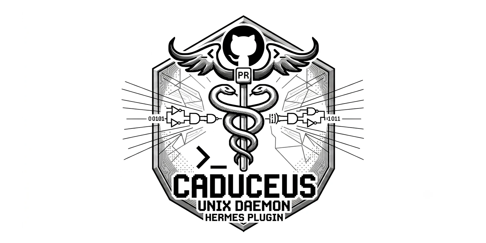

# Caduceus

<p align="center"><em>Your agent does the thinking. Caduceus does the paperwork.</em></p>

<p align="center">
  <a href="https://github.com/barkley-assistant/caduceus/releases"></a>
  <a href="LICENSE"></a>
  <a href="https://github.com/barkley-assistant/caduceus/actions/workflows/ci.yml"></a>
  <a href="https://github.com/barkley-assistant/caduceus/wiki"></a>
</p>

> A Hermes plugin that reviews your pull requests and implements your
> handoff tickets — without making you babysit either.

Caduceus is a Unix daemon, shipped as a Hermes plugin, that runs the
boring half of an AI-assisted coding loop on the repositories you
point it at. Two jobs, one binary:

1. **Reviews pull requests.** Every new revision of an open PR is run
   through an isolated, read-only review worker. The result is a
   structured PASS/FAIL verdict — findings with severities and
   remediation guidance — published as one sticky comment on the PR
   and updated in place as the PR evolves. A trusted `/caduceus
   review` comment on the PR re-reviews the current head on demand.
2. **Implements handoff tickets.** Label a ticket `autofix` and
   Caduceus claims it, provisions a fresh worktree, runs your AI
   harness against it under a hard timeout, and sees the job through
   — commit, push, pull request, completion comment, close. Every
   step is checkpointed *before* it happens, so a crash mid-run
   resumes from the last checkpoint instead of double-posting.

Both run on your machine, with your credentials, against your local
clones. Linux is tier-1; macOS is tier-2, compiles, runs, and is
enforced by CI. Windows is not a target. This is not the project for
you if that's a problem.

We're opinionated about three things, and the rest of this document
will tell you what they are, why, and how to push back when we're
wrong:

1. **Deterministic infrastructure does not live inside the
   non-deterministic loop.** The daemon owns polling, claims,
   worktrees, timeouts, Git, GitHub, retries, and the public-voice
   rule. The worker owns "what does the code say, and what should it
   say next?" They meet at a single env-var contract and a single
   `worker-result.json` file. We will not put an LLM call inside our
   state machine, and we will not put a GitHub API client inside
   your harness.
2. **Zero inbound networking, no shortcuts around the public-voice
   rule.** The daemon is pull-only, refuses to listen on any port,
   and refuses to publish a comment or PR body containing a hardcoded
   list of internal tool names. This is the only moralizing we do in
   the codebase, and we will defend it.
3. **The bridge is a file you own.** Setup seeds a reference bridge
   at `~/.hermes/caduceus/worker-bridge.py`. You edit that file. You
   point it at pi, codex, claude-code, or your own custom harness —
   Caduceus has no opinion about which one. Plugin source updates
   will not overwrite your bridge. If the upstream bridge template
   changes, setup writes a sibling `.new` candidate and tells you,
   instead of clobbering your edits.

If you want a managed hosted product with a web dashboard and a
monthly invoice, this is not it. If you want a single Rust binary and
a Python script and the ability to read every line of the code that
runs on your behalf, welcome.

**A note on what this project is for**: Caduceus exists to reduce the
operator's workload, not to remove the operator from the loop. Every
PR Caduceus opens is opened for a human to read and merge; every
review verdict is a recommendation, not a verdict from on high. We
are not building toward a system where a bot ships code unattended
while the maintainers sleep. If that is what you want, this is not
the project for you either.

## How It Works

```
                ┌─────────────────────────────┐
   [GitHub]◀───▶│       Caduceus daemon       │◀─── `caduceus run`
   (outbound    │  (Rust · single binary)     │     every 2 min,
    only)       │  · ETag-aware 304 polling   │      cron-driven
                │  · scheduler leadership     │
                │  · per-issue claim files    │
                │  · isolated git worktrees   │
                │  · hard worker timeout      │
                │  · public-voice validator   │
                └──────────────┬──────────────┘
                               │  sanitized env (no gh creds)
                               │  bounded transcript pipe
                               ▼
                ┌─────────────────────────────┐
                │    your worker-bridge.py     │  ← you own this
                │   (the bridge is harness-    │     file. edit it.
                │    agnostic; ship the        │
                │    reference or your own)    │
                └─────────────────────────────┘
```

The daemon polls GitHub on a schedule. Each tick does two things:

- **Reviews.** It polls open PRs in the watched repos, admits each
  new head revision as an immutable review target, and runs it
  through an isolated review worker. The verdict lands as one stable
  sticky comment per PR — no comment spam, no "reviewed 12 minutes
  ago" churn. New revisions are re-reviewed automatically; a trusted
  `/caduceus review` comment re-reviews on demand.
- **Implements.** It polls issues carrying the `autofix` label,
  claims each under a per-issue lease (bounded by
  `worker_parallelism`), provisions a worktree, spawns the bridge as
  a child of a Rust worker supervisor (not systemd, not a shell),
  waits for exit, then finalizes: commit, push, find-or-create the
  PR, post the completion comment, close the issue.

Deep dives: [Auto Review](docs/auto-review.md) covers the review
flow end to end; the
[wiki](https://github.com/barkley-assistant/caduceus/wiki/Home) is
the operator's manual for the ticket flow.

## Install (Hermes)

Requires **Hermes Agent v0.18.2 or newer**.

```bash
hermes plugins install barkley-assistant/caduceus --enable
hermes caduceus setup                 # build + seed your bridge
hermes caduceus cron-install          # 2-min no-agent job
hermes caduceus status                # verify
```

The install does three things, in order, and is idempotent:

- `cargo build --release --locked` of the Rust binary.
- Atomic install of the binary as `<plugin>/bin/caduceus`.
- Seed `~/.hermes/caduceus/worker-bridge.py` (only if absent; the
  shipped template lives in `plugin-assets/worker-bridge.py`).

`hermes plugins update caduceus` refreshes the source; rerun
`hermes caduceus setup` to rebuild. Before removal, run
`hermes caduceus cron-remove` then `hermes plugins remove caduceus`;
your state, your bridge, and your config all survive.

## Install (Standalone, No Hermes)

If you'd rather not use Hermes, you can run the binary directly. You
lose the plugin's skill, slash command, and cron integration, but the
daemon is the same:

```bash
git clone https://github.com/barkley-assistant/caduceus
cd caduceus
cargo build --release --locked
install -m 0755 target/release/caduceus ~/.local/bin/caduceus

# config at ~/.config/caduceus/config.yaml under `caduceus:`
# see https://github.com/barkley-assistant/caduceus/wiki/Configuration for the full schema
```

A standalone install **requires** you set `worker_command`
explicitly. The daemon refuses to start without it. This is on
purpose: the Hermes plugin has a default bridge path; you don't, so
the daemon makes you say it out loud.

One naming note: `caduceus setup` (the subcommand) is a different,
smaller thing — it only generates the minimal non-secret config file.
The build-and-seed step you skip by going standalone is
`hermes caduceus setup`, which needs the Hermes plugin and is not
part of this path.

### Workers run sandboxed (OCI)

Caduceus can dispatch workers inside a hardened container instead of
directly on the host. The whole sandbox lives under one nested
`sandbox:` section:

```yaml
executor_mode: oci
sandbox:
  engine: docker            # or podman
  image: "caduceus-worker@sha256:<64 lowercase hex>"  # required, no default
  pull_policy: if_missing   # never | if_missing | always
  resources: { cpus: 2.0, memory_mb: 2048, pids: 256, tmpfs_mb: 256, shm_mb: 64 }
  network: none             # none | unrestricted (never host)
  pass_env: []              # exact names only; credentials refused at load
```

The enforceable baseline is not negotiable: read-only rootfs,
`--cap-drop ALL`, `no-new-privileges`, bounded memory/pids/tmpfs, no
devices or engine sockets, no host namespaces, and a daemon-owned
read-only `.git` shadow over the real gitdir. `network: none`
(default) means loopback only; `unrestricted` is the engine's
isolated bridge — host networking is structurally unrepresentable.
Workers run as the worktree owner's real UID/GID, never a hard-coded
identity.

TrustedHost configs (the default) may omit `sandbox:` entirely;
`executor_mode: oci` fails to load without a valid digest-pinned
`sandbox.image`. Run `caduceus doctor` to check OCI readiness — the
same live checks the dispatch boundary runs. Crash recovery is a
restart: startup reconciliation converges durable rows and orphaned
containers without manual cleanup.

The full enforcement story and the certification suite live in
[docs/certification/oci-certification.md](docs/certification/oci-certification.md)
and on the
[configuration wiki page](https://github.com/barkley-assistant/caduceus/wiki/Configuration).

## The 60-Second Orientation

1. `git clone`, `cargo build`, `hermes caduceus setup` (or the
   standalone equivalent above).
2. Put your watched repos at `~/projects/<owner>/<repo>` (the
   `workdir_base` layout) with non-interactive git credentials —
   an SSH key or a credential helper. A watched repo without a local
   clone is refused, not retried forever.
3. Create the trigger label in each repo:

   ```bash
   gh label create "autofix" --repo OWNER/REPO --color 7C3AED \
     --description "Triggers Caduceus code automation"
   ```

4. Drop the label on an issue. Wait two minutes. Watch
   `caduceus status`. When the daemon picks it up, the bridge runs
   and you get a PR. For PR review, set `auto_review.enabled: true`
   (requires OCI; see [docs/auto-review.md](docs/auto-review.md)).
5. **First time, run with `CADUCEUS_DRY_RUN=1`.** Dry-run does
   everything except commit / push / comment / label-mutate / PR /
   close. It writes a `<run_id>.dry-run.md` report under
   `<state_dir>/runs/`. You should be reading that report before the
   first real run. Trust, but verify.

## The four keys you need to know about

You will not get far without these. The full schema lives in
[configuration](https://github.com/barkley-assistant/caduceus/wiki/Configuration);
this is the short version with the opinions attached.

- `watched_repos` — the list of `owner/repo` pairs the daemon polls.
  Each entry must resolve to a local clone under
  `workdir_base/<owner>/<repo>` with a working `origin` remote
  *before* the daemon will pick anything up. This is not a courtesy —
  a daemon that quietly retried GitHub forever against a missing
  clone is how you burn through a rate limit at 3 a.m. and never
  know why.
- `worker_command` — the path the daemon execs after a tick. The
  Hermes plugin seeds a default at
  `~/.hermes/caduceus/worker-bridge.py`; a standalone install
  requires this field to be set explicitly. A daemon that silently
  invents a worker path is a daemon that will surprise you on the
  one host where the convention does not hold.
- `poll_interval_seconds` — how often the cron tick fires. Default
  is `120`. The plugin installs a 2-minute cron job; the operator can
  override per environment. Lower it if you want; do not set it to
  zero and expect a polite daemon.
- `ticket_label_code` — the GitHub label that triggers a ticket
  implementation run (default `autofix`). Legacy emoji values
  (`🤖 auto-fix`) are translated to the canonical name at read time
  with a one-time warning; re-label open issues after upgrading,
  because the daemon only polls the canonical label.
  `auto_review.enabled` turns on PR review (requires
  `executor_mode: oci`); see [docs/auto-review.md](docs/auto-review.md).

Everything else lives in
[configuration](https://github.com/barkley-assistant/caduceus/wiki/Configuration).
If a config key is not named there, it is not part of the public
contract surface; the daemon ignores it, which is the honest answer
to "why does my custom key do nothing?"

## Auth: two different credentials

Operators conflate these constantly, so here it is in one sentence:
the **GitHub API token (PAT)** Caduceus holds is for the API — polling,
labels, comments, PRs; the **git authentication** used for
`push` comes from your SSH agent or credential helper. Configure
both, and don't reuse one for the other.

## CLI reference

The `caduceus` binary exposes eight top-level commands. A bare
`caduceus` invocation prints the help and exits 0; the cron job
invokes `caduceus run` explicitly. `--json` output uses a versioned
envelope; the queue commands emit `schema: "queue/1.0"` and `status`
emits its own `version`.

```text
caduceus run                          # run a single tick
caduceus status [--json]              # report daemon state
caduceus doctor [...]                 # live OCI readiness check
caduceus worktree-gc [...]            # sweep stale worktrees
caduceus queue <action>               # manage the work queue
                                      # (show, reset, reprocess, remove)
caduceus review <action>              # inspect review state
                                      # (status, list, show)
caduceus migrate-state [...]          # migrate legacy JSON in, or to SQLite
caduceus setup [--dry-run]            # generate minimal non-secret config
```

Every flag, default, exit code, and the `hermes caduceus` wrapper
surface is documented in the [CLI reference](docs/cli.md).

## The Operator's Manual

Moved out of the README on purpose. The README is the front door;
the manual is in the
[wiki](https://github.com/barkley-assistant/caduceus/wiki/Home):

- [installation](https://github.com/barkley-assistant/caduceus/wiki/Installation) —
  Hermes vs standalone, prerequisites, the cron contract.
- [configuration](https://github.com/barkley-assistant/caduceus/wiki/Configuration) —
  every config field, defaults, resolution order.
- [the-bridge](https://github.com/barkley-assistant/caduceus/wiki/The-Bridge) —
  the `worker-bridge.py` contract, the `CADUCEUS_*` env vars, the
  `worker-result.json` schema, how to plug in a different harness.
- [state-recovery](https://github.com/barkley-assistant/caduceus/wiki/State-Recovery) —
  corrupt state, stuck issues, the `migrate-state` command.
- [troubleshooting](https://github.com/barkley-assistant/caduceus/wiki/Troubleshooting) —
  the common failure modes with the actual error text and the actual
  fix.
- [faq](https://github.com/barkley-assistant/caduceus/wiki/FAQ) — short.
- [auto review](docs/auto-review.md) — operator guide, config
  reference, and troubleshooting for automated PR code review.
- [cli reference](docs/cli.md) — every subcommand, flag, and exit
  code (in-repo page).

### Transcripts

Each worker run produces one bounded transcript file at
`<state-dir>/runs/<run-id>.log`, capturing both stdout and stderr up
to `transcript_max_bytes` with a truncation marker. See the wiki for
the retention knobs.

## State, migration, and recovery

**Do not edit daemon state, metadata, claim files, or transcripts by
hand.** Caduceus owns those files. Use supported commands so it can
take its lock, validate input, and install changes atomically.

- JSON is the default state backend; SQLite is opt-in.
  `caduceus migrate-state --from <path> [--dry-run]` imports legacy
  JSON, `--to-sqlite` switches the backend. See
  [docs/migration.md](docs/migration.md) for the full upgrade
  procedure.
- Failed work: `caduceus queue show`, `caduceus queue reset
  OWNER/REPO#N [--dry-run]` (retry), `caduceus queue reprocess
  OWNER/REPO#N` (fast-track), `caduceus queue remove OWNER/REPO#N`
  (drop). Reset keeps the finalization checkpoint; the daemon never
  deletes remote branches or PRs.
- Stuck reviews: `caduceus review show OWNER/REPO PR`.
- `caduceus worktree-gc` sweeps stale worktrees when it is safe.

The full recovery playbook (corrupt state, stuck issues, stale
heartbeats) is on the
[wiki](https://github.com/barkley-assistant/caduceus/wiki/State-Recovery).

## What Caduceus Explicitly Is Not

Read this before you install it. We mean it.

- **Not a multi-host system.** Caduceus is one daemon per host. If
  you run two daemons on two machines, they will both poll the same
  org and step on each other. Multi-host state with proper leader
  election is a future conversation, and we are not going to ship a
  half-baked version of it because you asked nicely.
- **Not a GitHub App.** Caduceus uses a fine-grained PAT. GitHub App
  authentication with installation tokens is a future feature. The
  rotation story is better with App auth; we are not shipping it now
  because the migration story for operators on PAT is more important
  than the migration story for hypothetical future operators.
- **Not a managed hosted service.** We don't run your automation.
  You do. There is no web dashboard, no monthly invoice, no Slack
  integration that pings us. The binary is yours, the daemon logs to
  your disk, and your credentials never leave your machine.
- **Not "OpenCode inside the daemon".** The daemon has absolutely no
  opinion about which LLM you call. We ship a reference bridge
  because every project needs a starting point; the bridge currently
  calls OpenCode because that's what we use internally. Swap the
  bridge for pi, codex, claude-code, or your own script, and the
  daemon will not notice or care.
- **Not a human reviewer, and not an auto-merger.** Caduceus reviews
  code and opens PRs, but every verdict is a recommendation and
  every PR is opened for a human to read and merge. There is no
  auto-merge today. Policy-gated auto-merge with a documented policy
  in plain English is a future feature, not a current one.
- **Not a webhook receiver.** The daemon is pull-only. It polls
  GitHub on a schedule. We will never accept inbound HTTP. If you
  want push semantics, write a webhook → label-relabel shim in front
  of Caduceus; that's your shim, not ours.
- **Not a queue you can attach a custom worker to.** The worker
  contract is `worker-bridge.py` plus the `CADUCEUS_*` env vars plus
  the `worker-result.json` file. That's it. If you want to bypass
  that contract, you don't want Caduceus; you want a job queue.

## Contributing, Releasing, SemVer

This project follows [Semantic Versioning 2.0.0](https://semver.org/).
The public surface — `caduceus` CLI, the `Config` YAML schema, the
plugin manifest fields, the `worker-bridge.py` env-var contract, the
state file format, the default `comment_forbidden_strings` — is
versioned; everything else is implementation detail and can change
between minor releases.

- [`CONTRIBUTING.md`](CONTRIBUTING.md) — how to file issues, open
  PRs, what the CI expects, the commit format we use.
- [`RELEASING.md`](RELEASING.md) — SemVer policy, what counts as a
  breaking change, how release tags are cut.
- [`CHANGELOG.md`](CHANGELOG.md) — keep-a-changelog format. Every
  user-visible change lands an entry.
- [`AGENTS.md`](AGENTS.md) — agent guidance for both human
  contributors and AI tools. Read it before opening a PR.

## License

MIT. See [`LICENSE`](LICENSE).